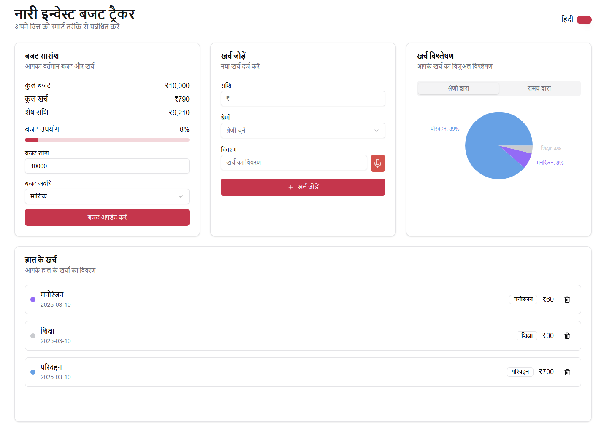
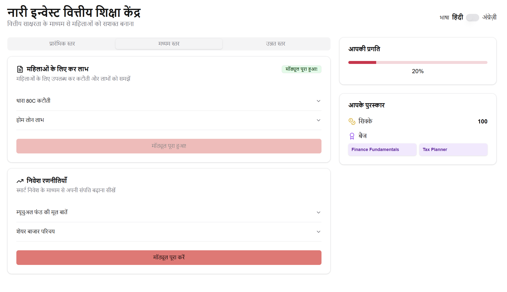
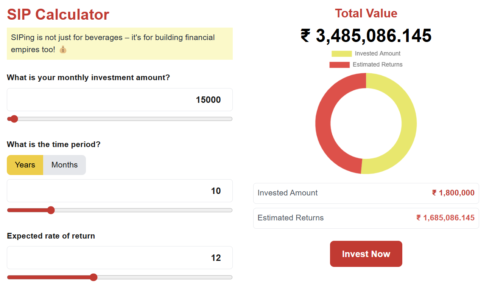
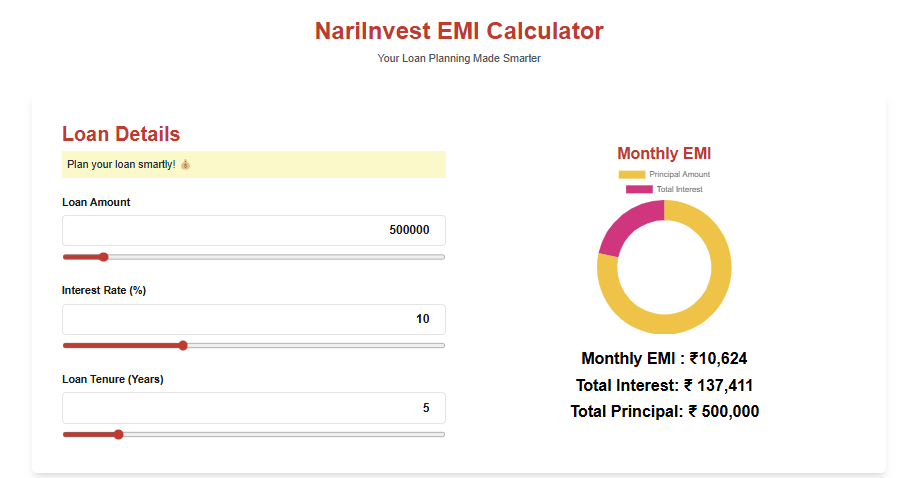
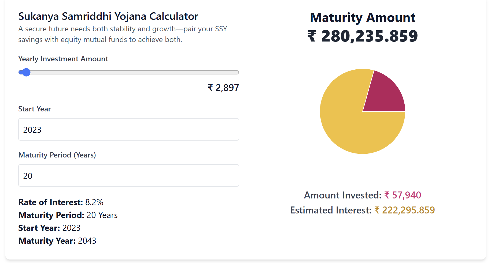

# Nari Invest - AI-Powered Financial Management for Women


## 📌 About Nari Invest
Nari Invest is a smart financial management platform that empowers women with AI-driven budgeting, expense tracking, and investment guidance. The platform makes financial planning simple, accessible, and personalized.
## [video]=https://drive.google.com/file/d/1z_MZuikfiSSiQXjrxS1UqbMA_9Uve_Io/view?usp=sharing

## 🚀 Features
### 1️⃣ **Budgeting & Expense Tracker**
- ✅ **Budget Goal Setting**: Set monthly or weekly budget limits.
- ✅ **Expense Entry**: Add expenses manually or via **voice input (Web Speech API)**.
- ✅ **AI-Based Categorization**: Uses **rule-based AI** (extendable to NLP) for classifying expenses (Food, Transport, Bills, etc.).
- ✅ **Dashboard & Reports**: Visual summaries with **graphs and insights**.
- ✅ **Multi-Language Support**: Default **Hindi**, easily switchable to other languages.



### 2️⃣ **Financial Education Hub**
- 📖 **Learning Modules** (Beginner to Advanced)
  - **Basic Finance**: Budgeting, Saving, Bank Accounts
  - **Financial Independence**: Planning for Emergencies, Retirement
  - **Women-Centric Finance**: Govt Schemes, Tax Benefits



### 3️⃣ **Financial Planning Tools**
- 📊 **SIP Calculator**
- 🏡 **EMI Calculator**
- 🎯 **Sukanya Samruddhi Yojna**





### 4️⃣ **Enhanced Investment Quiz UI**
- ✅ **User-Friendly & Inclusive**: Simple language, icons, and images.
- ✅ **Voice Assistant**: Reads questions aloud using Web Speech API.
- ✅ **Multilingual Support**: English, Hindi, Marathi, Tamil, Bengali, etc.
- ✅ **Smart Recommendations**: AI suggests investments based on user profile (PPF, SIPs, Mutual Funds, etc.).
- ✅ **Accessibility & Engagement**: Voice input, Leaderboard, Community Forum.


### 5️⃣ **Smart Investment Dashboard**
- **User Overview Panel**: Total Savings, Monthly Income vs Expenses, Risk Tolerance.
- **AI-Powered Investment Suggestions**:
  - **Safe Investments** → FD, RD, Gold ETFs, Govt Bonds
  - **Moderate Investments** → SIPs, Index Funds, Corporate Bonds
  - **High-Risk Investments** → Stocks, REITs, Crypto
- **Predictive Analytics & What-If Scenarios**: Wealth Growth Calculator, Investment Projections.
- **Portfolio Optimization & Rebalancing**: Live tracking & AI suggestions.


## 🛠 Tech Stack
- **Frontend**: React (Material UI / Tailwind CSS)
- **Backend**: Node.js with Express
- **Database**: Firebase / MongoDB
- **AI Categorization**: Rule-based approach (extendable with NLP)
- **Voice Input**: Web Speech API

## 📥 Installation & Setup
```sh
# Clone the repo
git clone https://github.com/yourusername/NariInvest.git
cd NariInvest

# Install dependencies
npm install

# Start the app
npm start


## Getting Started

First, run the development server:

```bash
npm run dev
# or
yarn dev
# or
pnpm dev
# or
bun dev
```

Open [http://localhost:3000](http://localhost:3000) with your browser to see the result.

You can start editing the page by modifying `app/page.tsx`. The page auto-updates as you edit the file.

This project uses [`next/font`](https://nextjs.org/docs/app/building-your-application/optimizing/fonts) to automatically optimize and load [Geist](https://vercel.com/font), a new font family for Vercel.

## Learn More

To learn more about Next.js, take a look at the following resources:

- [Next.js Documentation](https://nextjs.org/docs) - learn about Next.js features and API.
- [Learn Next.js](https://nextjs.org/learn) - an interactive Next.js tutorial.

You can check out [the Next.js GitHub repository](https://github.com/vercel/next.js) - your feedback and contributions are welcome!

## Deploy on Vercel

The easiest way to deploy your Next.js app is to use the [Vercel Platform](https://vercel.com/new?utm_medium=default-template&filter=next.js&utm_source=create-next-app&utm_campaign=create-next-app-readme) from the creators of Next.js.

Check out our [Next.js deployment documentation](https://nextjs.org/docs/app/building-your-application/deploying) for more details.
